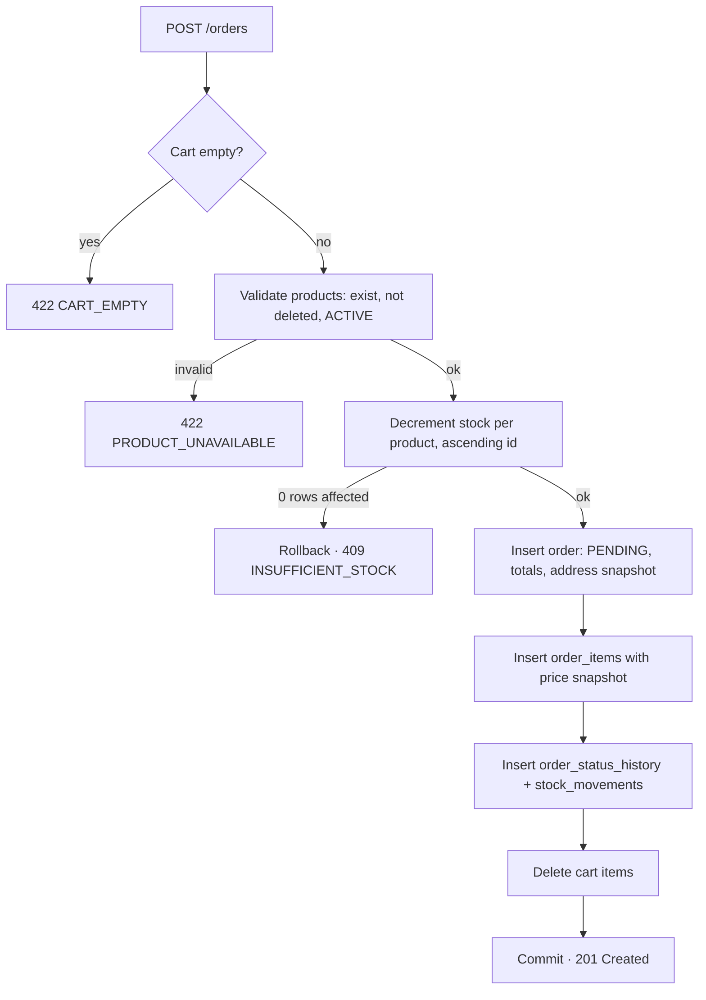
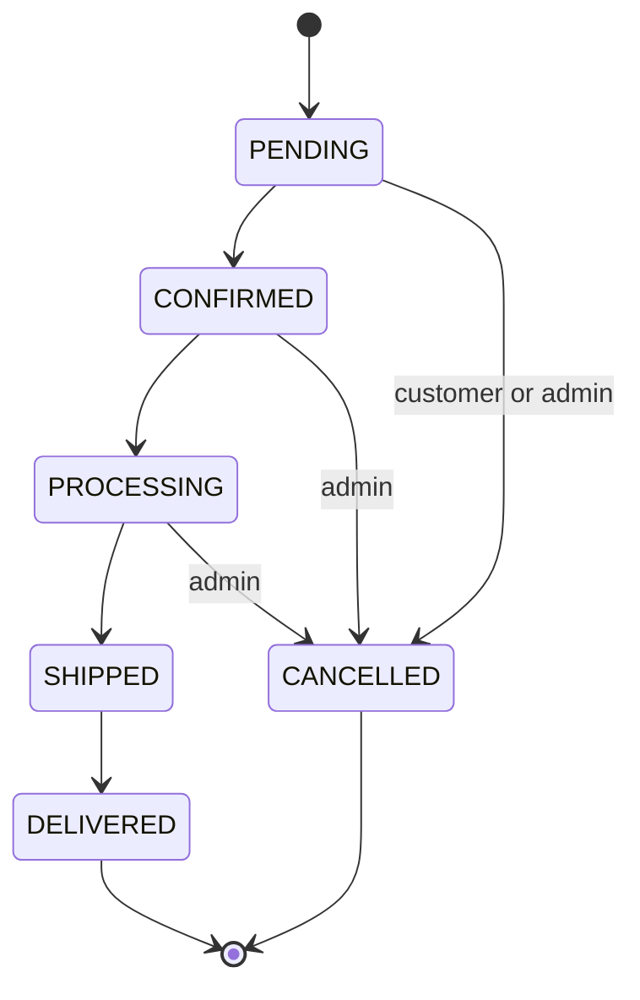
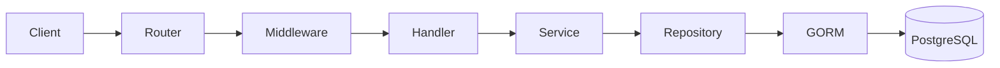
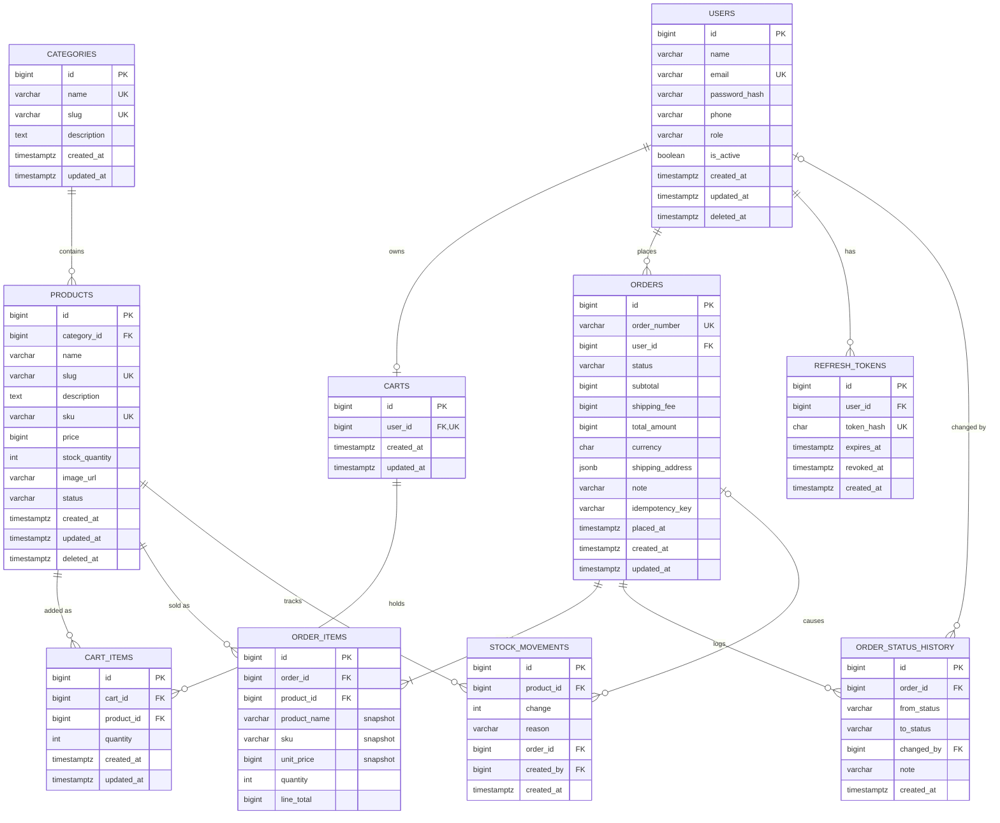

# E-commerce Backend API — PRD & ERD

**Version:** 1.0 · **Date:** 2026-10-04

## Table of contents

1. [Overview](#1-overview)
2. [Goals, non-goals and success metrics](#2-goals-non-goals-and-success-metrics)
3. [User roles and permissions](#3-user-roles-and-permissions)
4. [Functional requirements](#4-functional-requirements)
5. [Business rules](#5-business-rules)
6. [API specification](#6-api-specification)
7. [Response format, errors and status codes](#7-response-format-errors-and-status-codes)
8. [Non-functional and security requirements](#8-non-functional-and-security-requirements)
9. [Architecture and project structure](#9-architecture-and-project-structure)
10. [ERD](#10-erd)
11. [Milestones and roadmap](#11-milestones-and-roadmap)
12. [Risks and open questions](#12-risks-and-open-questions)

---

## 1. Overview

A monolithic REST API in Go that lets customers browse products, manage a cart and place orders, and lets admins manage the catalog, inventory, users and orders. The frontend is out of scope; clients are Postman, a future web app or a mobile app.

| Item | Decision |
| --- | --- |
| Project type | RESTful e-commerce backend (portfolio-grade) |
| Language / framework | Go 1.22+ with Gin |
| ORM | GORM |
| Database | PostgreSQL 15+ |
| Migrations | golang-migrate (versioned SQL files, not GORM AutoMigrate in production) |
| Auth | JWT: short-lived access token + rotating refresh token |
| Password hashing | bcrypt (cost 12) |
| Docs | Swagger / OpenAPI 3 via swaggo |
| Config | Environment variables (.env for local) |
| Packaging | Docker + docker-compose (API + Postgres) |
| Architecture | Layered: Handler → Service → Repository → DB |
| API base path | /api/v1 |

**In scope (MVP):** auth, user profile, categories, products with search/filter/pagination, cart, checkout, orders, admin order management, inventory, dashboard stats.

**Out of scope (MVP):** payment gateway, shipping integration, reviews, coupons, wishlist, notifications, microservices, Redis, Kafka.

## 2. Goals, non-goals and success metrics

**Goals**

1. A customer can go from registration to a placed order using only the API.
2. Stock never goes negative, even under concurrent checkouts.
3. Past orders keep the price paid, regardless of later price changes.
4. Clean, testable layering that a reviewer can read in one sitting.

**Non-goals**

- Real payments, multi-vendor marketplace, multi-currency, multi-language.
- Horizontal scaling infrastructure (caching, queues) in the MVP.

**Success metrics**

| Metric | Target |
| --- | --- |
| p95 latency, read endpoints (local, 10k products) | < 100 ms |
| p95 latency, checkout | < 300 ms |
| Unit test coverage, service layer | ≥ 70% |
| Integration tests for checkout and auth flows | 100% of happy + main error paths |
| Concurrent checkout test (50 buyers, stock 10) | exactly 10 orders, stock = 0 |
| Every endpoint documented in Swagger | 100% |

## 3. User roles and permissions

Three actors: **Guest** (no token), **Customer** (role = CUSTOMER) and **Admin** (role = ADMIN). Role is stored on the user and embedded in the JWT; authorization is enforced by middleware, and ownership checks (a customer's own cart and orders) in the service layer.

| Capability | Guest | Customer | Admin |
| --- | --- | --- | --- |
| Register / login / refresh | ✓ | ✓ | ✓ |
| Browse, search, filter products and categories | ✓ | ✓ | ✓ |
| View / update own profile, change password | — | ✓ | ✓ |
| Manage own cart | — | ✓ | — |
| Place order, view own orders, cancel own PENDING order | — | ✓ | — |
| Create / update / delete products and categories | — | — | ✓ |
| Adjust inventory | — | — | ✓ |
| View all orders, update order status | — | — | ✓ |
| List users, change role, activate / deactivate user | — | — | ✓ |
| View dashboard statistics | — | — | ✓ |

Admins are seeded via a migration or CLI command; public registration always creates a CUSTOMER.

## 4. Functional requirements

Each requirement has an ID (FR-x.y) so tests and commits can reference it.

### 4.1 Authentication

| ID | Requirement | Acceptance criteria |
| --- | --- | --- |
| FR-1.1 | Register with name, email, password, optional phone | Email unique (case-insensitive); password ≥ 8 chars; returns 201 with user (no hash); duplicate → 409 EMAIL_ALREADY_EXISTS |
| FR-1.2 | Login with email + password | Returns access token (15 min) + refresh token (7 days); wrong credentials → 401 INVALID_CREDENTIALS (same message for unknown email); inactive user → 403 |
| FR-1.3 | Refresh access token | Valid refresh token → new pair, old refresh token revoked (rotation); revoked/expired → 401 |
| FR-1.4 | Logout | Revokes the given refresh token; returns 204 |

### 4.2 User profile

| ID | Requirement | Acceptance criteria |
| --- | --- | --- |
| FR-2.1 | Get own profile | Returns id, name, email, phone, role, created_at |
| FR-2.2 | Update own profile | Name and phone editable; email and role not editable here |
| FR-2.3 | Change password | Requires current password; revokes all refresh tokens of the user |

### 4.3 Categories

| ID | Requirement | Acceptance criteria |
| --- | --- | --- |
| FR-3.1 | List and get categories (public) | Sorted by name; includes product count |
| FR-3.2 | Admin creates / updates a category | Name unique; slug auto-generated and unique |
| FR-3.3 | Admin deletes a category | Blocked with 409 CATEGORY_HAS_PRODUCTS if any product references it |

### 4.4 Products

| ID | Requirement | Acceptance criteria |
| --- | --- | --- |
| FR-4.1 | List products (public) with pagination | Default page=1, limit=20, max limit=100; response includes pagination meta |
| FR-4.2 | Search and filter | search (name/description, case-insensitive), category_id, min_price, max_price, in_stock, status (admin only), sort |
| FR-4.3 | Get product by id or slug | Public sees ACTIVE only; DRAFT/ARCHIVED → 404 for non-admins |
| FR-4.4 | Admin creates a product | SKU unique; price > 0; stock ≥ 0; category must exist |
| FR-4.5 | Admin updates a product | Partial update (PATCH); price change does not affect existing orders |
| FR-4.6 | Admin deletes a product | Soft delete (deleted_at); product disappears from listings and carts; historic order items keep working |

### 4.5 Inventory

| ID | Requirement | Acceptance criteria |
| --- | --- | --- |
| FR-5.1 | Admin sets or adjusts stock | Body `{"adjustment": 10, "reason": "RESTOCK"}` (negative to reduce); result never below 0 → 422 INSUFFICIENT_STOCK; writes a stock_movements row |
| FR-5.2 | Low-stock listing | Admin can list products with stock ≤ threshold (default 5) |

### 4.6 Cart

| ID | Requirement | Acceptance criteria |
| --- | --- | --- |
| FR-6.1 | Get own cart | Cart auto-created on first access; returns items with current price, line subtotal, cart total |
| FR-6.2 | Add item | If product already in cart, quantities merge; total quantity ≤ stock else 422 INSUFFICIENT_STOCK; inactive product → 422 PRODUCT_UNAVAILABLE |
| FR-6.3 | Update item quantity | quantity ≥ 1 and ≤ stock; 0 is rejected (use delete) |
| FR-6.4 | Remove item / clear cart | Returns 204 |

### 4.7 Orders (customer)

| ID | Requirement | Acceptance criteria |
| --- | --- | --- |
| FR-7.1 | Checkout: create order from cart | Body: shipping address + optional note; empty cart → 422 CART_EMPTY; full flow in section 5.4 |
| FR-7.2 | Idempotent checkout | Optional Idempotency-Key header; same key within 24 h returns the same order |
| FR-7.3 | List own orders | Paginated, newest first, filter by status |
| FR-7.4 | Get own order detail | Includes items with snapshot name, SKU, unit price; another user's order → 404 |
| FR-7.5 | Cancel own order | Only when PENDING; restores stock in the same transaction |

### 4.8 Admin

| ID | Requirement | Acceptance criteria |
| --- | --- | --- |
| FR-8.1 | List all orders | Filter by status, user_id, date range; paginated |
| FR-8.2 | Update order status | Only transitions allowed by the state machine (5.5); invalid → 409 INVALID_STATUS_TRANSITION; each change logged in order_status_history |
| FR-8.3 | Manage users | List/search users, change role, activate/deactivate (deactivated users cannot log in) |
| FR-8.4 | Dashboard stats | Total revenue (all orders except CANCELLED), orders by status, orders today / last 30 days, top 5 products by units sold, low-stock count |

## 5. Business rules

### 5.1 Money

All amounts are stored as integers in the smallest currency unit (BIGINT, e.g. paisa / cents), never floats. Single currency for the MVP (configured, default BDT). The API returns the integer amount plus a currency code.

### 5.2 Inventory

- Stock is checked when adding to cart (soft check) and again inside the checkout transaction (hard check). Only the checkout check is authoritative; a cart does not reserve stock.
- Stock is decremented with a conditional update:

  ```sql
  UPDATE products
  SET stock_quantity = stock_quantity - $qty
  WHERE id = $id AND stock_quantity >= $qty;
  ```

  Zero rows affected → the whole order is rolled back with 409 INSUFFICIENT_STOCK, naming the product.
- Products are processed in ascending id order to avoid deadlocks between concurrent checkouts.
- Cancelling an order restores the stock of every item in the same transaction.
- Every stock change writes a row to stock_movements.

### 5.3 Price and product snapshot

order_items stores product_name, sku, unit_price and line_total copied at checkout. A later price change, rename or soft delete of the product never changes an existing order.

Example: product price is 120 when the customer orders 2 → order item stores unit_price = 120, line_total = 240. If the price later becomes 150, the old order still shows 120.

Order totals:

- subtotal = Σ line_total
- shipping_fee = flat, configurable (0 allowed for MVP)
- total_amount = subtotal + shipping_fee

### 5.4 Checkout flow (single DB transaction)



1. Load the user's cart with items; empty → 422 CART_EMPTY.
2. Validate every product: exists, not deleted, status ACTIVE; else 422 PRODUCT_UNAVAILABLE.
3. Decrement stock per product with the conditional update (5.2).
4. Insert the order (status PENDING, order_number like ORD-20261004-000123, shipping address snapshot, totals).
5. Insert order_items with snapshots.
6. Insert the first order_status_history row (null → PENDING) and stock_movements rows (reason ORDER).
7. Delete the cart items.
8. Commit. Any failure rolls back every step above.

### 5.5 Order status rules



| From | Allowed next status | Who |
| --- | --- | --- |
| PENDING | CONFIRMED, CANCELLED | Admin; customer may cancel |
| CONFIRMED | PROCESSING, CANCELLED | Admin |
| PROCESSING | SHIPPED, CANCELLED | Admin |
| SHIPPED | DELIVERED | Admin |
| DELIVERED | — (terminal) | — |
| CANCELLED | — (terminal) | — |

Customers can only cancel while PENDING; admins can cancel until SHIPPED. Cancelling restores stock. Every change writes a row to order_status_history with who changed it and an optional note.

## 6. API specification

All routes are prefixed with `/api/v1`. Auth = Bearer access token in the `Authorization` header.

| Method | Path | Auth | Description | Success |
| --- | --- | --- | --- | --- |
| POST | /auth/register | Public | Register customer | 201 |
| POST | /auth/login | Public | Login, returns token pair | 200 |
| POST | /auth/refresh | Public (refresh token) | Rotate token pair | 200 |
| POST | /auth/logout | Customer/Admin | Revoke refresh token | 204 |
| GET | /users/me | Customer/Admin | Own profile | 200 |
| PATCH | /users/me | Customer/Admin | Update name/phone | 200 |
| PUT | /users/me/password | Customer/Admin | Change password | 204 |
| GET | /categories | Public | List categories | 200 |
| GET | /categories/:id | Public | Category detail | 200 |
| POST | /admin/categories | Admin | Create category | 201 |
| PATCH | /admin/categories/:id | Admin | Update category | 200 |
| DELETE | /admin/categories/:id | Admin | Delete category | 204 |
| GET | /products | Public | List, search, filter, paginate | 200 |
| GET | /products/:idOrSlug | Public | Product detail | 200 |
| POST | /admin/products | Admin | Create product | 201 |
| PATCH | /admin/products/:id | Admin | Update product | 200 |
| DELETE | /admin/products/:id | Admin | Soft delete product | 204 |
| POST | /admin/products/:id/stock | Admin | Adjust stock | 200 |
| GET | /admin/products/low-stock | Admin | Low-stock list | 200 |
| GET | /cart | Customer | Get cart | 200 |
| POST | /cart/items | Customer | Add item | 201 |
| PATCH | /cart/items/:itemId | Customer | Change quantity | 200 |
| DELETE | /cart/items/:itemId | Customer | Remove item | 204 |
| DELETE | /cart | Customer | Clear cart | 204 |
| POST | /orders | Customer | Checkout | 201 |
| GET | /orders | Customer | Own orders | 200 |
| GET | /orders/:id | Customer | Own order detail | 200 |
| POST | /orders/:id/cancel | Customer | Cancel PENDING order | 200 |
| GET | /admin/orders | Admin | All orders | 200 |
| GET | /admin/orders/:id | Admin | Any order detail | 200 |
| PATCH | /admin/orders/:id/status | Admin | Change status | 200 |
| GET | /admin/users | Admin | List/search users | 200 |
| PATCH | /admin/users/:id | Admin | Change role / active flag | 200 |
| GET | /admin/dashboard | Admin | Statistics | 200 |
| GET | /health | Public | Liveness + DB ping | 200 |

Write routes for the catalog live under `/admin` so authorization is one middleware per route group; reads stay public.

### 6.1 Product list query parameters

| Param | Type | Example | Notes |
| --- | --- | --- | --- |
| search | string | phone | ILIKE on name and description (pg_trgm index later) |
| category_id | int | 3 | |
| min_price, max_price | int (minor units) | 100000 | Inclusive |
| in_stock | bool | true | stock_quantity > 0 |
| status | enum | ACTIVE | Admin only; public always ACTIVE |
| sort | enum | price_asc | newest (default), price_asc, price_desc, name_asc |
| page, limit | int | 1, 20 | limit max 100 |

Example:

```text
GET /api/v1/products?category_id=1&min_price=100000&max_price=5000000&sort=price_asc&page=1&limit=20
```

### 6.2 Request examples

Add to cart — `POST /cart/items`

```json
{ "product_id": 5, "quantity": 2 }
```

Checkout — `POST /orders` (header `Idempotency-Key: 7f3c…`)

```json
{
  "shipping_address": {
    "full_name": "Rahim Uddin",
    "phone": "+8801700000000",
    "line1": "House 12, Road 5",
    "city": "Dhaka",
    "postal_code": "1205",
    "country": "BD"
  },
  "note": "Call before delivery"
}
```

Change status — `PATCH /admin/orders/:id/status`

```json
{ "status": "SHIPPED", "note": "Courier tracking #A123" }
```

## 7. Response format, errors and status codes

Every response uses one envelope. Lists add a `meta` block; errors carry a machine-readable code and, for validation, per-field details.

Success (single):

```json
{
  "success": true,
  "message": "Product fetched successfully",
  "data": { "id": 5, "name": "Phone X", "price": 1200000, "currency": "BDT" }
}
```

Success (list):

```json
{
  "success": true,
  "message": "Products fetched successfully",
  "data": [ { "id": 5, "name": "Phone X", "price": 1200000, "currency": "BDT" } ],
  "meta": { "page": 1, "limit": 20, "total": 134, "total_pages": 7 }
}
```

Error:

```json
{
  "success": false,
  "message": "Validation failed",
  "error": {
    "code": "VALIDATION_ERROR",
    "details": [ { "field": "quantity", "message": "must be at least 1" } ]
  },
  "request_id": "b1e4…"
}
```

| HTTP | When | Example error codes |
| --- | --- | --- |
| 200 OK | Successful read/update | — |
| 201 Created | Resource created | — |
| 204 No Content | Successful delete/logout (no body) | — |
| 400 Bad Request | Malformed JSON, bad query param type | BAD_REQUEST |
| 401 Unauthorized | Missing/invalid/expired token, bad credentials | UNAUTHORIZED, TOKEN_EXPIRED, INVALID_CREDENTIALS |
| 403 Forbidden | Authenticated but wrong role, or inactive user | FORBIDDEN, USER_INACTIVE |
| 404 Not Found | Resource missing or not owned by caller | PRODUCT_NOT_FOUND, ORDER_NOT_FOUND, CATEGORY_NOT_FOUND |
| 409 Conflict | Uniqueness or state conflict | EMAIL_ALREADY_EXISTS, SKU_ALREADY_EXISTS, CATEGORY_HAS_PRODUCTS, INVALID_STATUS_TRANSITION, INSUFFICIENT_STOCK (at checkout) |
| 422 Unprocessable | Valid shape, fails business rule or validation | VALIDATION_ERROR, CART_EMPTY, PRODUCT_UNAVAILABLE, INSUFFICIENT_STOCK (cart) |
| 429 Too Many Requests | Rate limit hit (phase 2) | RATE_LIMITED |
| 500 Internal Error | Unexpected failure; details logged, never returned | INTERNAL_ERROR |

Errors are defined once in an `apperror` package (code + HTTP status + message) and mapped to responses by a single middleware, so handlers never build error JSON by hand.

## 8. Non-functional and security requirements

| ID | Area | Requirement |
| --- | --- | --- |
| NFR-1 | Passwords | bcrypt cost 12; hash never serialized (`json:"-"`) or logged |
| NFR-2 | Tokens | HS256 access token 15 min with claims sub, role, exp; refresh token is a random 32-byte value, stored only as SHA-256 hash, 7 days, rotated on use |
| NFR-3 | Authorization | Role middleware per route group; ownership checks in services; other users' resources return 404, not 403 |
| NFR-4 | Validation | go-playground/validator on all request DTOs; reject unknown JSON fields; max body 1 MB |
| NFR-5 | SQL safety | GORM / parameterized queries only; sort fields from an allow-list, never raw user input |
| NFR-6 | Secrets & config | JWT secret, DB URL, CORS origins from env vars; app refuses to start if required vars are missing |
| NFR-7 | CORS | Explicit origin allow-list; no wildcard with credentials |
| NFR-8 | Performance | Indexed filters (section 10.3), pagination mandatory, N+1 avoided with Preload/joins; DB pool max 25 connections |
| NFR-9 | Reliability | Graceful shutdown on SIGTERM; request timeout 10 s; DB transactions for checkout, cancel, stock adjust |
| NFR-10 | Observability | Structured JSON logs (slog), request_id per request, access log with latency and status; /health endpoint |
| NFR-11 | Testing | Unit tests for services with mocked repositories; integration tests against real Postgres (testcontainers); concurrency test for checkout |
| NFR-12 | Documentation | Swagger UI at /swagger; README with setup, env vars, ERD and sample requests; Postman collection |
| NFR-13 | Rate limiting | Phase 2: per-IP limit on /auth (e.g. 10 req/min) |
| NFR-14 | Extensibility | Payment, reviews, coupons, wishlist, shipping, notifications addable as new modules without changing existing tables' meaning |

## 9. Architecture and project structure

Requests flow Router → Middleware → Handler → Service → Repository → GORM → PostgreSQL. Each layer depends only on the interface of the layer below, so services are unit-tested with fake repositories.



| Layer | Responsibility | Must not |
| --- | --- | --- |
| Router | Route groups, attach middleware per group (public, auth, admin) | Contain logic |
| Middleware | Request ID, logging, recovery, CORS, JWT auth, role check, error mapping | Touch the database |
| Handler | Bind + validate DTO, call service, write envelope response | Contain business rules or GORM calls |
| Service | Business rules, transactions, ownership checks, state machine | Know about HTTP (gin.Context) |
| Repository | Queries and persistence via GORM; accepts a tx handle | Contain business decisions |
| Model | GORM structs mapping tables | Be returned directly to clients (use response DTOs) |

Transactions: the service opens a transaction through a small TxManager (`WithTx(ctx, func(tx) error)`) and passes the tx-scoped repositories down, keeping GORM out of the service's signatures.

```text
ecommerce-api/
├── cmd/
│   └── api/main.go            # wiring: config, db, repos, services, router
├── internal/
│   ├── config/                # env loading + validation
│   ├── database/              # postgres connection, TxManager
│   ├── models/                # GORM models
│   ├── dto/                   # request / response structs
│   ├── repository/            # user, category, product, cart, order, token
│   ├── service/               # auth, user, catalog, inventory, cart, order, dashboard
│   ├── handler/               # one file per resource
│   ├── middleware/            # auth, role, requestid, logger, recovery, cors, errors
│   ├── router/                # route groups
│   └── pkg/
│       ├── apperror/          # error codes → HTTP
│       ├── jwt/
│       ├── hash/
│       ├── pagination/
│       └── response/          # envelope helpers
├── migrations/                # 000001_init.up.sql / .down.sql …
├── docs/                      # generated swagger
├── tests/integration/
├── docker-compose.yml
├── Dockerfile
├── Makefile                   # run, test, migrate-up, swag
├── .env.example
└── README.md
```

## 10. ERD

The MVP has 10 tables: the 7 core tables (users, categories, products, carts, cart_items, orders, order_items) plus refresh_tokens (secure refresh/logout), order_status_history (audit of status changes) and stock_movements (audit of every stock change). All ids are BIGSERIAL; all timestamps are TIMESTAMPTZ; money is BIGINT minor units.

Key idea: **orders keep a price snapshot; carts always read the live price.**



### 10.1 Relationships

| From | To | Cardinality | FK | On delete |
| --- | --- | --- | --- | --- |
| users | carts | 1 : 0..1 | carts.user_id (unique) | CASCADE |
| users | orders | 1 : N | orders.user_id | RESTRICT |
| users | refresh_tokens | 1 : N | refresh_tokens.user_id | CASCADE |
| categories | products | 1 : N | products.category_id | RESTRICT |
| carts | cart_items | 1 : N | cart_items.cart_id | CASCADE |
| products | cart_items | 1 : N | cart_items.product_id | CASCADE |
| orders | order_items | 1 : N (≥1) | order_items.order_id | CASCADE |
| products | order_items | 1 : N | order_items.product_id | RESTRICT (products are soft-deleted) |
| orders | order_status_history | 1 : N | order_status_history.order_id | CASCADE |
| users | order_status_history | 1 : N | order_status_history.changed_by (nullable) | SET NULL |
| products | stock_movements | 1 : N | stock_movements.product_id | RESTRICT |
| orders | stock_movements | 1 : N | stock_movements.order_id (nullable) | SET NULL |

### 10.2 Table definitions

**users**

| Column | Type | Constraints |
| --- | --- | --- |
| id | BIGSERIAL | PK |
| name | VARCHAR(100) | NOT NULL |
| email | VARCHAR(255) | NOT NULL, UNIQUE on lower(email) |
| password_hash | VARCHAR(255) | NOT NULL |
| phone | VARCHAR(20) | NULL |
| role | VARCHAR(20) | NOT NULL DEFAULT 'CUSTOMER', CHECK IN ('CUSTOMER','ADMIN') |
| is_active | BOOLEAN | NOT NULL DEFAULT true |
| created_at, updated_at | TIMESTAMPTZ | NOT NULL DEFAULT now() |
| deleted_at | TIMESTAMPTZ | NULL (soft delete) |

**refresh_tokens**

| Column | Type | Constraints |
| --- | --- | --- |
| id | BIGSERIAL | PK |
| user_id | BIGINT | FK → users.id, NOT NULL |
| token_hash | CHAR(64) | NOT NULL, UNIQUE (SHA-256 hex) |
| expires_at | TIMESTAMPTZ | NOT NULL |
| revoked_at | TIMESTAMPTZ | NULL |
| created_at | TIMESTAMPTZ | NOT NULL DEFAULT now() |

**categories**

| Column | Type | Constraints |
| --- | --- | --- |
| id | BIGSERIAL | PK |
| name | VARCHAR(100) | NOT NULL, UNIQUE |
| slug | VARCHAR(120) | NOT NULL, UNIQUE |
| description | TEXT | NULL |
| created_at, updated_at | TIMESTAMPTZ | NOT NULL DEFAULT now() |

**products**

| Column | Type | Constraints |
| --- | --- | --- |
| id | BIGSERIAL | PK |
| category_id | BIGINT | FK → categories.id, NOT NULL |
| name | VARCHAR(200) | NOT NULL |
| slug | VARCHAR(220) | NOT NULL, UNIQUE |
| description | TEXT | NULL |
| sku | VARCHAR(64) | NOT NULL, UNIQUE |
| price | BIGINT | NOT NULL, CHECK (price > 0) |
| stock_quantity | INTEGER | NOT NULL DEFAULT 0, CHECK (stock_quantity >= 0) |
| image_url | VARCHAR(500) | NULL |
| status | VARCHAR(20) | NOT NULL DEFAULT 'DRAFT', CHECK IN ('DRAFT','ACTIVE','ARCHIVED') |
| created_at, updated_at | TIMESTAMPTZ | NOT NULL DEFAULT now() |
| deleted_at | TIMESTAMPTZ | NULL (soft delete) |

**carts**

| Column | Type | Constraints |
| --- | --- | --- |
| id | BIGSERIAL | PK |
| user_id | BIGINT | FK → users.id, NOT NULL, UNIQUE |
| created_at, updated_at | TIMESTAMPTZ | NOT NULL DEFAULT now() |

**cart_items**

| Column | Type | Constraints |
| --- | --- | --- |
| id | BIGSERIAL | PK |
| cart_id | BIGINT | FK → carts.id, NOT NULL |
| product_id | BIGINT | FK → products.id, NOT NULL |
| quantity | INTEGER | NOT NULL, CHECK (quantity > 0) |
| created_at, updated_at | TIMESTAMPTZ | NOT NULL DEFAULT now() |
| — | — | UNIQUE (cart_id, product_id) |

No price is stored on cart items: the cart always shows the current price.

**orders**

| Column | Type | Constraints |
| --- | --- | --- |
| id | BIGSERIAL | PK |
| order_number | VARCHAR(30) | NOT NULL, UNIQUE |
| user_id | BIGINT | FK → users.id, NOT NULL |
| status | VARCHAR(20) | NOT NULL DEFAULT 'PENDING', CHECK IN ('PENDING','CONFIRMED','PROCESSING','SHIPPED','DELIVERED','CANCELLED') |
| subtotal | BIGINT | NOT NULL, CHECK (subtotal >= 0) |
| shipping_fee | BIGINT | NOT NULL DEFAULT 0 |
| total_amount | BIGINT | NOT NULL, CHECK (total_amount = subtotal + shipping_fee) |
| currency | CHAR(3) | NOT NULL DEFAULT 'BDT' |
| shipping_address | JSONB | NOT NULL (snapshot) |
| note | VARCHAR(500) | NULL |
| idempotency_key | VARCHAR(64) | NULL |
| placed_at | TIMESTAMPTZ | NOT NULL DEFAULT now() |
| created_at, updated_at | TIMESTAMPTZ | NOT NULL DEFAULT now() |
| — | — | UNIQUE (user_id, idempotency_key) |

**order_items**

| Column | Type | Constraints |
| --- | --- | --- |
| id | BIGSERIAL | PK |
| order_id | BIGINT | FK → orders.id, NOT NULL |
| product_id | BIGINT | FK → products.id, NOT NULL |
| product_name | VARCHAR(200) | NOT NULL (snapshot) |
| sku | VARCHAR(64) | NOT NULL (snapshot) |
| unit_price | BIGINT | NOT NULL, CHECK (unit_price > 0) (snapshot) |
| quantity | INTEGER | NOT NULL, CHECK (quantity > 0) |
| line_total | BIGINT | NOT NULL, CHECK (line_total = unit_price * quantity) |
| — | — | UNIQUE (order_id, product_id) |

**order_status_history**

| Column | Type | Constraints |
| --- | --- | --- |
| id | BIGSERIAL | PK |
| order_id | BIGINT | FK → orders.id, NOT NULL |
| from_status | VARCHAR(20) | NULL (null for creation) |
| to_status | VARCHAR(20) | NOT NULL |
| changed_by | BIGINT | FK → users.id, NULL |
| note | VARCHAR(500) | NULL |
| created_at | TIMESTAMPTZ | NOT NULL DEFAULT now() |

**stock_movements**

| Column | Type | Constraints |
| --- | --- | --- |
| id | BIGSERIAL | PK |
| product_id | BIGINT | FK → products.id, NOT NULL |
| change | INTEGER | NOT NULL, CHECK (change <> 0) (negative = out) |
| reason | VARCHAR(20) | NOT NULL, CHECK IN ('ORDER','CANCEL','ADJUSTMENT','RESTOCK') |
| order_id | BIGINT | FK → orders.id, NULL |
| created_by | BIGINT | FK → users.id, NULL |
| created_at | TIMESTAMPTZ | NOT NULL DEFAULT now() |

### 10.3 Indexes

| Table | Index | Serves |
| --- | --- | --- |
| products | (category_id), (status, created_at DESC), (price) | Filtering, default sort, price range |
| products | GIN pg_trgm on name (phase 2) | Fast ILIKE search |
| orders | (user_id, created_at DESC), (status, created_at DESC) | My orders, admin list |
| order_items | (product_id) | Top products stats |
| cart_items | UNIQUE (cart_id, product_id) | Merge on add |
| refresh_tokens | (user_id), UNIQUE (token_hash) | Lookup, revoke all |
| order_status_history | (order_id, created_at) | Timeline |
| stock_movements | (product_id, created_at DESC) | Stock audit |

## 11. Milestones and roadmap

The MVP is built in six milestones, each ending with passing tests and updated Swagger.

| # | Milestone | Deliverables | Done when |
| --- | --- | --- | --- |
| M1 | Foundation | Repo layout, config, Docker Compose, migrations, logger, envelope, apperror, /health | `make run` serves /health with DB ping |
| M2 | Auth & users | Register, login, refresh rotation, logout, profile, role middleware, admin seed | Auth integration tests pass |
| M3 | Catalog | Categories CRUD, products CRUD, search/filter/sort/pagination, soft delete, stock adjust | Filter combinations tested |
| M4 | Cart | Get/add/update/remove/clear, stock soft checks | Cart service tests pass |
| M5 | Orders | Checkout transaction, snapshots, idempotency, cancel, status machine, history, admin order APIs | Concurrency test: 50 buyers, stock 10 → 10 orders |
| M6 | Polish | Dashboard stats, admin users, full Swagger, README with ERD, Postman collection, CI (lint + test) | Fresh clone runs in < 5 min |

**Phase 2 (after MVP):** addresses (saved per user), product_images, reviews, wishlist, coupons, payments (SSLCommerz / Stripe with webhooks), rate limiting, pg_trgm search, Redis cache for product lists, email notifications.

## 12. Risks and open questions

| Risk | Impact | Mitigation |
| --- | --- | --- |
| Overselling under concurrent checkout | Negative stock, unfulfillable orders | Conditional UPDATE + CHECK (stock_quantity >= 0) + ordered locking + concurrency test |
| Float money errors | Wrong totals | BIGINT minor units everywhere, DB CHECKs on totals |
| Stolen refresh token | Account takeover | Hashed storage, rotation, revoke-all on password change |
| GORM AutoMigrate drift | Schema differs across environments | Versioned SQL migrations only |
| Scope creep (payments, microservices) | MVP never ships | Phase 2 list is frozen until M6 is done |

**Open questions**

- [ ] Should a cart reserve stock for a few minutes, or is checkout-time checking enough? (MVP assumption: no reservation.)
- [ ] Flat shipping fee or zero for the MVP?
- [ ] Should PENDING orders auto-cancel after N hours without confirmation?
- [ ] Guest cart (before login) needed, or customers only?